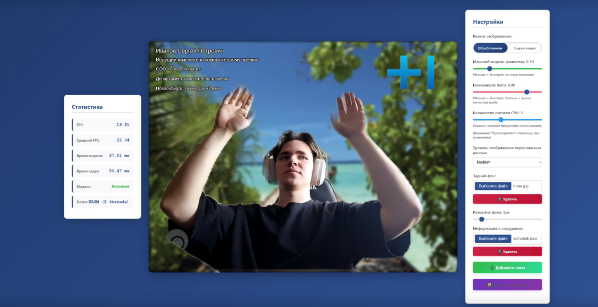

# Цифровой дресс-код
Это решения для хакатона T1 - "Цифровой дресс-код: фон, который выделяет вас"  

## Запуск
! Требуется установленный [node.js](https://nodejs.org/en) и npm
```
cd front
npm install
npm start
```
Приложение будет доступно по адресу localhost:3000  
    
(*Примечание: для запуска npm install может понадобиться VPN*)

## Интерфейс


### Удаление фона и обработка изображения
- Моделью для сегментации была выбрана [RVM](https://github.com/PeterL1n/RobustVideoMatting?tab=readme-ov-file)  
- Предобработка: 
    - Уменьшение размера входного изображения
    - Нормализация и передача изображения в модель
- Постобработка:
    - Temporal smoothing между соседними масками
    - Морфологические операции
    - Размытие маски
    - Масштабирование до оригинального размера

### Настройки
#### Настройки работы модели:
- Режим отображения - Включить/выключить модель
- Масштаб модели - Выбор того, насколько будет уменьшено изображжение с камеры, перед передачей в модель (меньше - быстрее, больше - качественнее)
- DownsampleRatio - Выбор внутреннего разрешения модели (меньше - быстрее, больше - качественнее)
- Количество потоков CPU - Сколько потоков процессора использовать
  
#### Представлены следующие настройки фона:
- Загрузка данных о сотруднике
- Выбор уровня отображения персональных данных
- Выбор фона (Включая .gif)
- Добавление своего текста на фон
- Возможность редактирования каждого текствого поля
- Добавление своих картинок, помимо лого компании (Включая .gif)
- Возможность редатирования каждого изображения
- Степень размытия заднего фона (загруженного, либо реального)
  
### Статистика
- FPS: Количество кадров
- Среднее FPS: Среднее количество кадров
- Время модели: Время обработки 1 кадра моделью
- Время кадра: Полное время обработки одного кадра
- Модель: Активна или отключена модель 
- Decice: Количество используемых потоков процессора
